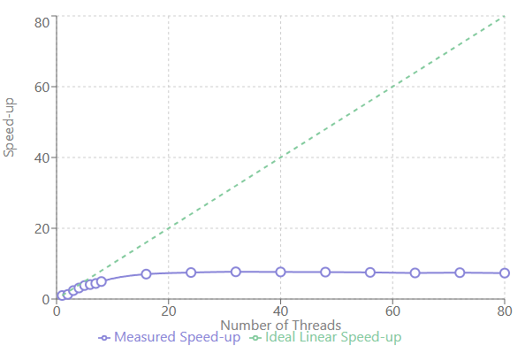
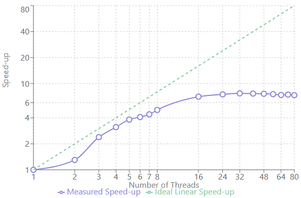

# Project 2 – Multithreaded Hash Computation

## Results Table  

|Thread Count|Wall Clock Time (s)|User Time (s)|System Time (s)|Speed-up|
|:--:|--:|--:|--:|:--:|
|1 |14.08|13.46| 0.46|1.00|
|2 |10.85|20.62| 0.54|1.30|
|3 | 5.90|16.03| 0.63|2.39|
|4 | 4.51|15.85| 0.68|3.12|
|5 | 3.69|15.98| 0.74|3.82|
|6 | 3.44|17.23| 0.94|4.09|
|7 | 3.21|17.19| 1.11|4.39|
|8 | 2.85|16.91| 1.25|4.94|
|16| 2.00|18.34| 3.00|7.04|
|24| 1.88|19.28| 6.87|7.49|
|32| 1.83|18.91|14.61|7.69|
|40| 1.84|18.10|24.23|7.65|
|48| 1.85|17.33|31.33|7.61|
|56| 1.87|17.35|40.27|7.53|
|64| 1.91|17.19|35.34|7.37|
|72| 1.89|16.85|46.20|7.45|
|80| 1.92|17.25|43.07|7.33|

---

## Speed-up Graphs  

---

## Why doesn’t “more threads” always mean “more speed”?  

Adding threads is like adding people to a single turnstile: once the turnstile itself becomes the bottleneck, crowding more people in line does nothing.  In the program, critical sections (locks on input data and hash storage), cache contention, and scheduler overhead all grow with thread count.  Past about 16 threads, waiting and coordination dominate, so wall-clock time stops falling and speed-up plateaus.

---

## Timing-based Amdahl Analysis  

The two serial regions measured:

* `main program` (setup) 0.047 288  s  
* `results output`    0.129 314  s  

Total run-time (1 thread) 15.537 965  s  

$$
s \;=\; \frac{0.047288355 + 0.129314901}{15.537965461}\;\approx\;0.0114
$$

So the parallel fraction is  

$$
p = 1 - s \approx 0.9886
$$

Predicted speed-up for **16 threads**:

$$
\text{speed-up} \;=\; 
\frac{1}{(1-p) + \dfrac{p}{16}}
\;=\;
\frac{1}{0.0114 + \dfrac{0.9886}{16}}
\;\approx\;\boxed{13.67}
$$

The observed speed-up at 16 threads is 7.04, roughly half the theoretical ideal—overhead, memory bandwidth limits, and non-perfect load balancing explain the gap.

---

## Is perfect scaling ($1-p=0$) possible?  

No.  Every real program must perform some serial work: startup, argument parsing, allocation, I/O, synchronization, etc.  Even with heroic engineering, $s$ can be *small* but never exactly zero, so perfect linear scaling remains unattainable in practice.

---

## Linearity Check & Slope  

Using the points (1 thread, 1.00 speed-up) and (7 threads, 4.39 speed-up):

$$
m \;=\; \frac{4.39 - 1.00}{7 - 1} \;\approx\; 0.56
$$

The first few data points lie on an almost straight line with slope ≈ 0.56, but the curve flattens beyond ~16 threads.  Cache saturation, lock contention, and context-switch overhead grow faster than the useful work each extra thread can contribute, causing diminishing returns.

---
