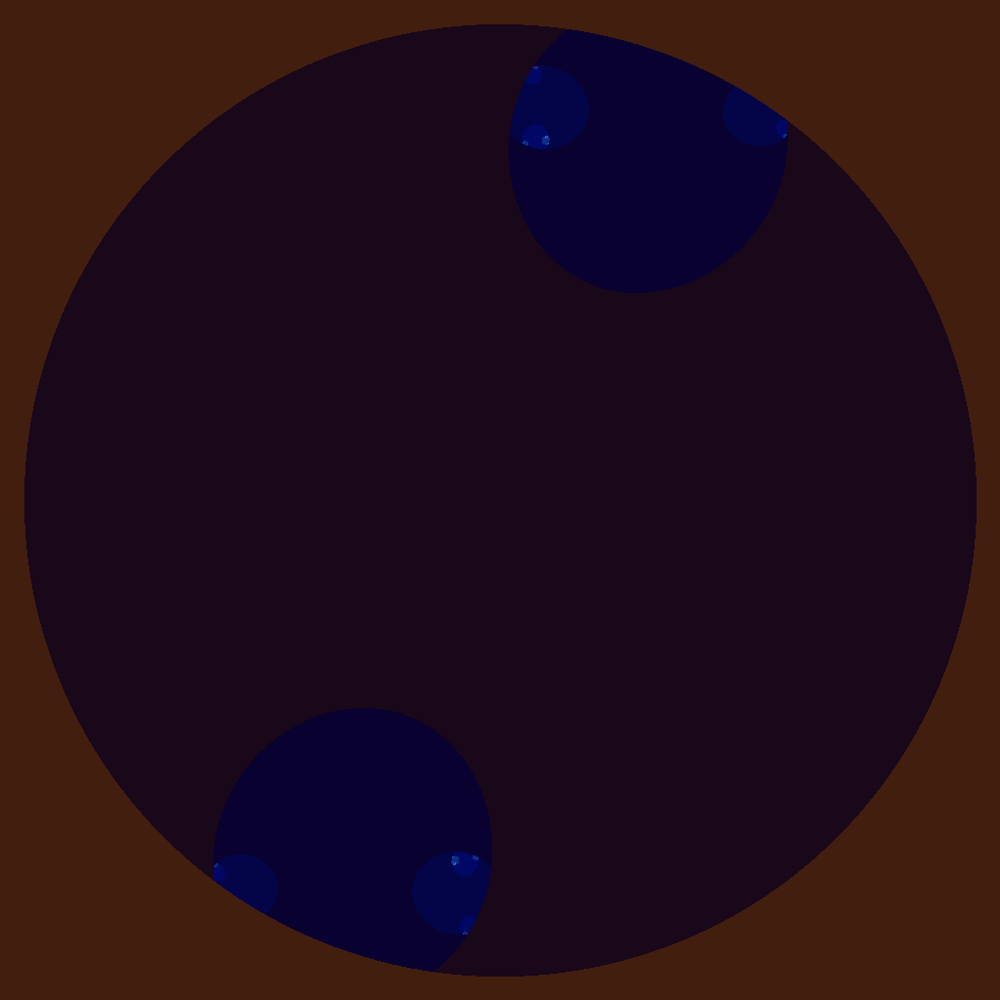

# Project 4 – CUDA **iota** & Julia-set Generator  

| File           | Description                                 |
|---------------:|---------------------------------------------|
| `iota.cpp`     | CPU version using `std::iota`               |
| `iota.cu`      | CUDA kernel implementation    |
| `runTrials.sh` | Script that times `iota.cpp` vs. `iota.cu`  |
| `julia.cpp`    | CPU Julia/Mandelbrot PPM generator          |
| `julia.cu`     | CUDA port of Julia-set generator       |

## iota results & discussion

### Timing tables  

#### CPU (`iota.cpu`)

| Vector Length | Wall Clock (s) | User (s) | Sys (s) |
|:--:|--:|--:|--:|
| 10 | 0.00 | 0.00 | 0.00 |
| 100 | 0.00 | 0.00 | 0.00 |
| 1 000 | 0.00 | 0.00 | 0.00 |
| 10 000 | 0.00 | 0.00 | 0.00 |
| 100 000 | 0.00 | 0.00 | 0.00 |
| 1 000 000 | 0.00 | 0.00 | 0.00 |
| 5 000 000 | 0.02 | 0.00 | 0.02 |
| 100 000 000 | 0.59 | 0.09 | 0.50 |
| 500 000 000 | 2.98 | 0.46 | 2.51 |
| 1 000 000 000 | 5.93 | 0.91 | 5.01 |
| 5 000 000 000 | 33.64 | 5.92 | 27.72 |

#### GPU (`iota.gpu`)

| Vector Length | Wall Clock (s) | User (s) | Sys (s) |
|:--:|--:|--:|--:|
| 10 | 0.31 | 0.02 | 0.28 |
| 100 | 0.21 | 0.01 | 0.19 |
| 1 000 | 0.21 | 0.01 | 0.20 |
| 10 000 | 0.21 | 0.00 | 0.20 |
| 100 000 | 0.21 | 0.00 | 0.20 |
| 1 000 000 | 0.21 | 0.01 | 0.20 |
| 5 000 000 | 0.25 | 0.02 | 0.22 |
| 100 000 000 | 0.87 | 0.17 | 0.69 |
| 500 000 000 | 3.28 | 0.78 | 2.49 |
| 1 000 000 000 | 6.82 | 1.78 | 5.04 |
| 5 000 000 000 | 48.06 | 9.42 | 38.65 |

**Are the results what you expected? Speculate as to why it looks like CUDA isn’t a great solution for this problem.**  
Yes. Each GPU launch has a lot of latency and two PCIe transfers. The per-element work is only one addition, so the overhead takes over for small/medium arrays. Only at billions of elements does the GPU approach CPU time, and even there the CPU’s cache-friendly loop is still strong. CUDA excels when each thread does _lots_ of math, not one integer add.

---

## CUDA Julia-set image

*Figure 1: Julia set rendered by `julia.gpu` with constant \(c = 2.1 + 2.1i\).*
